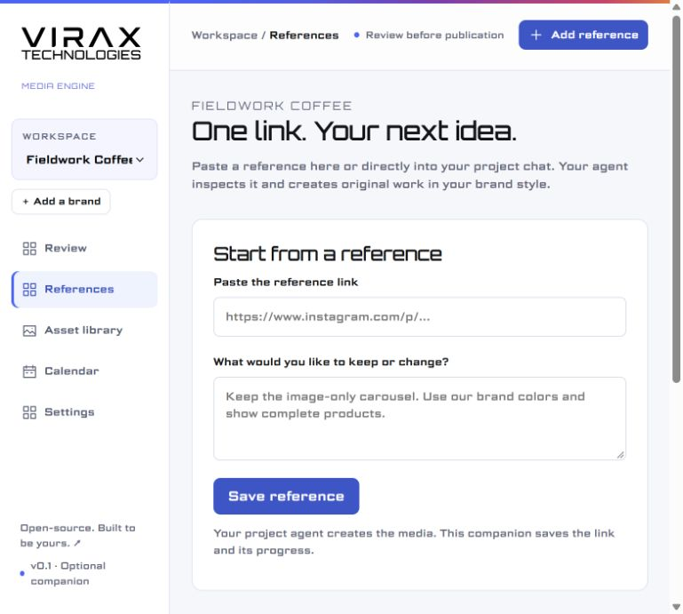

# VIRAX Media Engine

**Your content engine, inside your project chat.**

Tell your agent what you need.
It asks useful questions, saves your brand rules, and creates finished content.
Paste a reference link when you want to adapt an idea or style.

The optional browser companion helps you review posts, approve versions, inspect assets, or change settings.
You do not need to use a separate app for normal requests.

**[Start in chat →](START-HERE.md)** · [Project instructions](PROJECT-INSTRUCTIONS.md) · [Examples](examples/fieldwork/finished-example.zip) · [Support and limits](docs/platforms.md)

## Start with one message

Create a separate project for your business in ChatGPT or your chosen agent.
Paste this request into its chat:

> Set up VIRAX Media Engine for my business: https://github.com/vahe-s/virax-media-engine. Read START-HERE.md. Work with me in this project chat. Ask up to three questions at a time. Save my lasting preferences. Handle the technical steps with your available tools. Open the optional companion only when useful.

Your agent checks its tools and access before setup.
It explains a missing connection only when that connection affects your request.
A repository link provides instructions; it does not grant access to your computer or social accounts.

## Just say what you want

| Your message | What the agent does |
| --- | --- |
| “Here is my business website.” | Studies the business, asks focused questions, and suggests a content mix |
| “Use this reference: [link].” | Inspects the actual media and adapts its idea, style, format, and use of text |
| “Use blue from now on.” | Updates the saved brand profile and uses the new rule in future tasks |
| “Only change this post.” | Keeps the change in that post |
| “Two funny posts and two factual posts each week.” | Saves the exact weekly mix |
| “Show sources in the caption.” | Saves the public source preference; keeps private evidence records |
| “Show me the next batch.” | Returns finished media in chat or opens the companion for review |
| “Schedule these approved posts.” | Uses the exact account, versions, times, and valid publication permission |

The public engine has no Instagram DM listener, sender pairing, inbox scan, or DM trigger.
References come from links that the user pastes into chat or the companion.

## Rules that survive a new chat

The private brand profile stores colors, fonts, voice, content types, CTAs, source preferences, and lasting owner rules.
Each change has a version and a history.
A correction replaces the named rule instead of adding a conflicting copy.

The engine exports these files after a brand change:

- `brand-profile.json`: the saved settings and rules.
- `brand-profile.md`: readable instructions for another agent.
- `PROJECT-INSTRUCTIONS.md`: the entry point for this brand's project.

Keep the latest files in the project sources or its connected private folder.
Google Drive backup sync can copy profiles, media, sources, and records after changes.
See [project setup](docs/chat-workflow.md) and [Google Drive setup](docs/google-drive.md).

## Finished examples

Fieldwork Coffee is a fictional example brand.
These nine images use distinct subjects and compositions.
They contain no technical coffee claims or real stock offers.


| Single-image post | Instagram Story |
| --- | --- |
|  |  |

[Download the media, caption, alt text, and source record](examples/fieldwork/finished-example.zip).
[Read the editable example brief](examples/fieldwork/example.json).

## Optional companion

Your agent starts the local server when a visual review or settings screen helps.
Open it inside the available ChatGPT browser, or another supported browser on the same computer.

```sh
npm ci
npm start
```

The default address is **http://127.0.0.1:4318**.
The companion uses VIRAX's logo, Orbitron, and Science Gothic.
Its accents combine Facebook blue with Instagram purple, pink, and orange.
Client posts follow the client's own brand rules.



## What is ready

| Function | Release status |
| --- | --- |
| Chat instructions and project setup | Included; works through the user's capable agent |
| Saved preferences and named rules | Implemented, versioned, and exported |
| Pasted reference intake | Implemented; requires actual agent inspection before a draft |
| Ideas without references | Equal setup path; seven style directions and an agent-created sample before a batch |
| Useful capability tips | Chat guidance with regular, fewer, or no tips |
| Content mix and CTA | Exact weekly counts, random choices, and custom prompts |
| Image creation and research | Uses the agent's authorized tools |
| Fact review | Required for every post; public source preference is saved |
| Media export and review | Real assets, phone previews, captions, sources, and exact-version approval |
| Google Drive backup sync | Manual and automatic backups verified with one authorized private account |
| Local publication queue | Durable schedules, permissions, duplicate checks, and recovery |
| Meta publication | One Instagram Feed image verified live; carousels, Stories, and Facebook use simulated contract tests |
| Automatic music | Not implemented; removed from standard setup; existing requirements stay intact |
| Video publication | Documented native or agent-assisted path |

The engine does not run a hidden model or add an AI provider bill.
Its checks require evidence records; a capable agent or reviewer must verify their truth.
It stops uncertain factual drafts instead of presenting guesses as facts.

Chat and saved rules do not require a continuously open companion.
Scheduled publication and automatic Drive sync need a running process at the relevant time.
Drive holds files; it does not run that process.
A cloud service needs its own verified setup.

## For agents and contributors

- [Entry point](START-HERE.md)
- [Agent rules](AGENTS.md)
- [Chat workflow and project setup](docs/chat-workflow.md)
- [Reference workflow](docs/references.md)
- [Interview guide](docs/onboarding.md)
- [Creative controls and source policy](docs/creative-controls.md)
- [Agent commands](docs/agent-workflow.md)
- [Templates](templates/README.md)
- [Platform support](docs/platforms.md)
- [Architecture](docs/architecture.md)
- [Deployment](docs/deployment.md)
- [Verification](docs/verification.md)
- [Security](SECURITY.md)

## License

The code uses the [MIT License](LICENSE).
[Example artwork](examples/ASSET-LICENSE.md), [fonts](public/fonts/README.md), and [VIRAX identity](public/brand/README.md) have separate terms.
Private brand files and credentials do not belong in this public repository.
